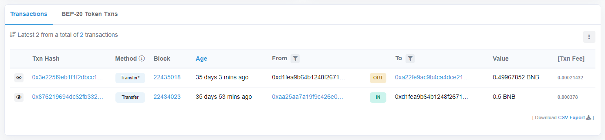
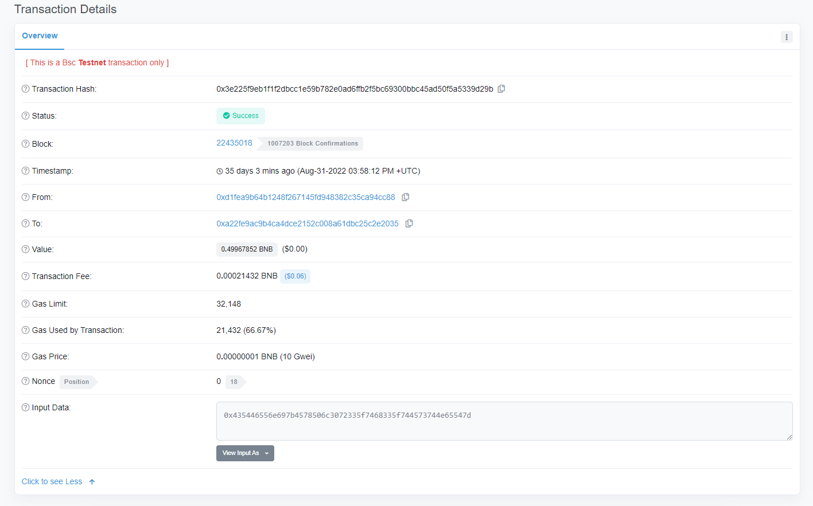
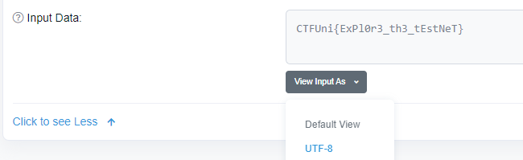

# María Dolores
- **Categoría:** OSINT
- **Dificultad:** ★★☆☆☆
- **Autor:** [ineesdv](https://www.linkedin.com/in/ineesdv/) & [elmagoflags](https://twitter.com/elmagoflags)

### Descripción
La abuelita María Dolores se ha aficionado a twitter, donde ha aprendido sobre la existencia de las criptomonedas y ha acabado creándose una cartera.  
Tras invertir todos sus ahorros, parece que la han robado. Ayúdala a averiguar qué ha ocurrido.  

Solamente sabemos que su username es AbuelitaCryptos.  

### Archivos e instrucciones
El reto no tiene archivos.

### Hints
1. ¿Conoces la etiqueta ALT de twitter? 
2. Busca la transacción en exploradores de blockchain.
3. Las cuentas seguidas de la abuelita podrían darte pistas sobre qué moneda se utiliza.

### Flag
``CTFUni{ExPl0r3_th3_tEstNeT}`` 
 

# Writeup
### 1. Obtener información de Twitter
María Dolores va contando cómo se creó una cuenta en alguna red de blockchain, invirtió dinero y se lo han robado.  
Aparecen varias pistas:
- El banner de María Dolores se corresponde con BnB, una moneda de cryptos, a la que casualmente también sigue en twitter
- En la foto del meme, su nieto le está hablando de la **testnet**
- En el post en el que crea la cuenta, hay una descripción de imagen (*ALT*) con la dirección de su cartera: `Nota para que no se me olvide: 0xd1fEA9B64b1248f267145Fd948382c35Ca94Cc88`

### 2. Ver las transacciones
Con toda la información anterior, se puede deducir que las transacciones se han hecho en la testnet de BnB.  
Habrá que entrar en un buscador como [bscscan](https://testnet.bscscan.com), por ejemplo, e introducir la cartera.  

Se ven dos transacciones, una de ingreso y otra de retirada:  

Entrando en la que retira el dinero y dándole a expandir detalles podemos ver que hay información extra relacionada con la transacción:  
 

Al ponerla en UTF-8, se encuentra la flag.  

  
Flag: **CTFUni{ExPl0r3_th3_tEstNeT}**