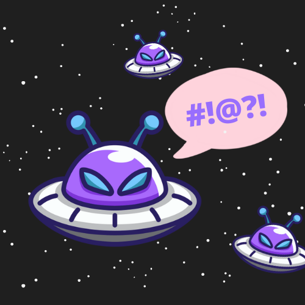

# Aliens
- **Categoría:** Crypto
- **Dificultad:** ★☆☆☆☆
- **Autor:** [ineesdv](https://www.linkedin.com/in/ineesdv/)

### Descripción
Los aliens de CTFUni han venido a Madrid, pero no conseguimos entender su idioma.  

Nos han dado la bienvenida diciendo "FEAVKAVET@G BX AKAVJH WUQBVHG!", que quiere decir "Bienvenid@s al evento humanos!".  

Pero ahora no dejan de repetir una frase muy rara que no consigo entender. ¿Podrás descifrarla?  

AVWHZBFUAVB, KAH DUA AVJEAVTAG VUAGJZH ETEHQB. BDUE AGJB JU MXBY: SJMUVE{BXEAV_GUFGJEJUJEHV}  
  

### Archivos e instrucciones
Ningún archivo necesario.

### Hints
1. ¡La traducción se parece mucho! Son hasta de la misma longitud.
2. No, no es un ROT. ¿Te has fijado en que la misma letra se traduce siempre igual?
3. Cifrado por Sustitución. Dcode.fr te puede ayudar a resolverlo.

### Formato de la flag
``CTFUni{TEXTO_EN_MAYÚSCULAS}``
