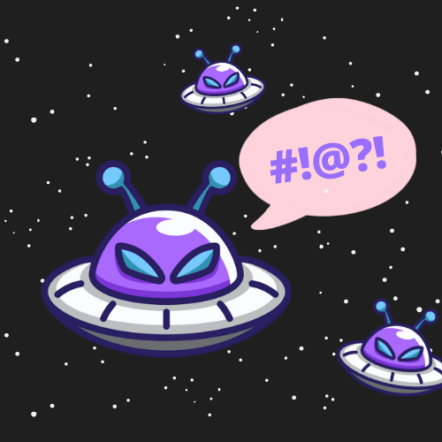

# Aliens
- **Categoría:** Crypto
- **Dificultad:** ★☆☆☆☆
- **Autor:** [ineesdv](https://www.linkedin.com/in/ineesdv/)

### Descripción
Los aliens de CTFUni han venido a Madrid, pero no conseguimos entender su idioma.  

Nos han dado la bienvenida diciendo "FEAVKAVET@G BX AKAVJH WUQBVHG!", que quiere decir "Bienvenid@s al evento humanos!".  

Pero ahora no dejan de repetir una frase muy rara que no consigo entender. ¿Podrás descifrarla?  

AVWHZBFUAVB, KAH DUA AVJEAVTAG VUAGJZH ETEHQB. BDUE AGJB JU MXBY: SJMUVE{BXEAV_GUFGJEJUJEHV}  
  



### Archivos e instrucciones
Ningún archivo necesario.


### Hints
1. ¡La traducción se parece mucho! Son hasta de la misma longitud.
2. No, no es un ROT. ¿Te has fijado en que la misma letra se traduce siempre igual?
3. Cifrado por Sustitución. Dcode.fr te puede ayudar a resolverlo.

### Flag
``CTFUni{ALIEN_SUBSTITUTION}``

<br>

# Writeup
Tenemos un texto y su correspondiente cifrado:
`Bienvenid@s al evento humanos!` → `FEAVKAVET@G BX AKAVJH WUQBVHG!`

  
Ambos textos tienen la misma longitud, parece que es algún tipo de transformación/operación entre letras.  
Buscando la correspondencia, a primera vista no parece haber ningún tipo de relación (no es un ROT, no tenemos ninguna clave, etc):  
B (98) → F (70)  
i (105) → E (69)  
e (101) → A (65)  
n (110) → V (86)  
  
   
También se puede también que una letra siempre se convierte en la misma.  
Se puede concluir en que probablemente sea un **cifrado por sustitución**.   
<br>
  
Construyendo la tabla:  

| Original | A | B | C | D | E | F | G | H | I | J | K | L | M | N | O | P | Q | R | S | M | N | O | P | Q | R | S |
|----------|---|---|---|---|---|---|---|---|---|---|---|---|---|---|---|---|---|---|---|---|---|---|---|---|---|---|
| Cifrado  | B | F | ? | T | A | ? | ? | W | E | ? | ? | X | Q | V | ? | ? | ? | ? | G | ? | U | K | ? | ? | ? | ? |

Se podría utilizar alguna página web para hacer la sustitución, como por ejemplo [dcode.fr](https://www.dcode.fr/chiffre-substitution), o con un script sencillo de python:
```python
new = ""
text = "AVWHZBFUAVB, KAH DUA AVJEAVTAG VUAGJZH ETEHQB. BDUE AGJB JU MXBY: SJMUVE{BXEAV_GUFGJEJUJEHV}"
dict = {'B':'A', 'F':'B', 'T':'D', 'A':'E', 'W':'H', 'E':'I', 'X':'L', 'Q':'M', 'V':'N', 'H':'O', 'G':'S', 'U':'U', 'K':'V'}
for c in text:
     if c in dict.keys():
             new += dict[c]
     else:
             new += c

print(new)
```

Obtenemos el texto decodificado casi al completo:  
`'ENHOZABUENA, VEO DUE ENJIENDES NUESJZO IDIOMA. ADUI ESJA JU MLAY: SJMUNI{ALIEN_SUBSJIJUJION}'`  
  
<br>

Utilizando la lógica podemos completar el diccionario:
Z → R
D → Q
J → T
M → F
S → C
Y → G

En la tabla:

| Original | A | B | C | D | E | F | G | H | I | J | K | L | M | N | O | P | Q | R | S | M | N | O | P | Q | R | S |
|----------|---|---|---|---|---|---|---|---|---|---|---|---|---|---|---|---|---|---|---|---|---|---|---|---|---|---|
| Cifrado  | B | F | S | T | A | M | Y | W | E | ? | ? | X | Q | V | ? | ? | D | Z | G | J | U | K | ? | ? | ? | ? |

Actualizando el diccionario en el script, obtendremos el mensaje completo:
```python
new = ""
text = "AVWHZBFUAVB, KAH DUA AVJEAVTAG VUAGJZH ETEHQB. BDUE AGJB JU MXBY: SJMUVE{BXEAV_GUFGJEJUJEHV}"
dict = {'B':'A', 'F':'B', 'T':'D', 'A':'E', 'W':'H', 'E':'I', 'X':'L', 'Q':'M', 'V':'N', 'H':'O', 'G':'S', 'U':'U', 'K':'V', 'Z':'R', 'D':'Q', 'J':'T', 'M':'F', 'S':'C', 'Y':'G'}
for c in text:
     if c in dict.keys():
             new += dict[c]
     else:
             new += c

print(new)
```
<br>

Texto original:  
``ENHORABUENA, VEO QUE ENTIENDES NUESTRO IDIOMA. AQUI ESTA TU FLAG: CTFUNI{ALIEN_SUBSTITUTION}``   
<br>
  
**Flag:** CTFUni{ALIEN_SUBSTITUTION}