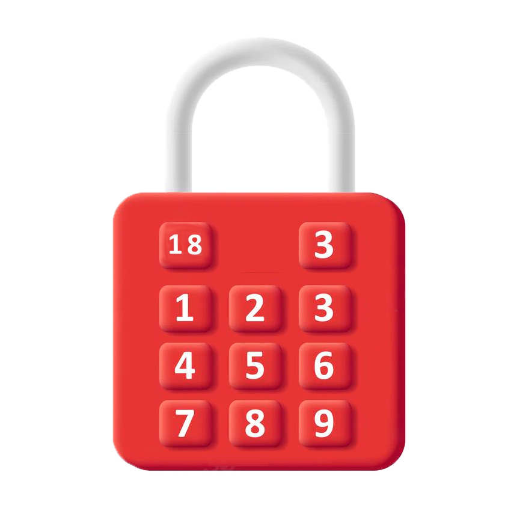
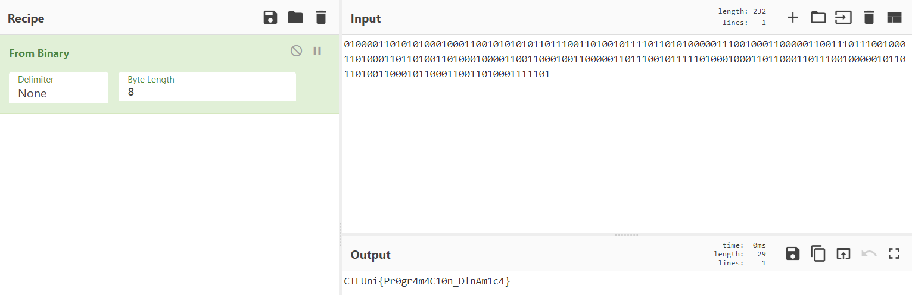

# Candado inteligente
- **Categoría:** Misc (Programming)
- **Dificultad:** ★★★★★
- **Autor:** [isaaclo97](https://isaaclo97.github.io/)

### Descripción
Solo los más inteligentes podrán adivinar la clave y entrar.  
Para adivinar la clave tenemos una serie de candados, cada uno de ellos contiene una serie de botones con números.
En la parte superior del candado se observan dos números.  
El primero de ellos es el número que debes conseguir y el otro el número máximo de veces que puedes pulsar botones.  
Si logras conseguirlo, tendrás la flag.  
  


   
   
## Archivos e instrucciones
Candados.zip  

### Hints
1. Hacer a mano no es una buena opción
2. Utilizar un algoritmo de fuerza bruta no es buena 
opción
3. Coin Change Problem
  
  
### Flag
`CTFUni{Pr0gr4m4C10n_DlnAm1c4}`   

<br>

# Writeup

### Analizando como funciona el reto

La descripción explica el reto, el fichero que se ofrece contiene 232 archivos con extensión .lock y cada uno con una serie de descripciones del candado.

### Ideas

1. Calcular a mano cada una de las combinaciones, problema son 232 archivos y algunos muy grandes.
2. Hacer un programa con fuerza bruta que pruebe todas las combinaciones, problema algunas instancias con el programa de fuerza bruta, problema tarda un poco (horas).
3. Hacer un programa eficiente que use programación dinámica y resuelva las instancias rápido.


### Programa mediante fuerza bruta

Aproximación en C++ de una posible solución para una instancia con fuerza bruta.\

#### Lectura de la entrada


```
#include <bits/stdc++.h>
using namespace std;
bool solve;
int sum, total,n,val;


int main() {
    freopen("flag.txt", "a", stdout);
    for (int i = 0; i < 232; i++) {
        const string path = "locks\\lock_"+(to_string(i))+".secret";
        freopen(path.c_str(), "r", stdin);
        solve = false;
        scanf("%d %d", &sum, &total);
        scanf("%d", &n);
        vector<int> a;
        for (int x = 0; x < n; x++) {
            scanf("%d", &val);
            a.push_back(val);
        }
        sort(a.begin(), a.end());
        vector<vector<int> > dp(n + 1, vector<int>(sum + 1, -1));
        solve(a, sum, n, dp, 0);
        if (solve) cout << 1;
        else cout << 0;
    }
}
```

El método solve para solucionar con backtracking sería:

```

int solve(vector<int>& a, int v, int n, int steps){
    if(v==0 && steps<=total) solve=true;
	if(solve) return 1;
    if (v == 0) return 1;
    if (n == 0) return 0;
    if (a[n - 1] <= v) return coinchange(a, v - a[n - 1], n,steps+1) + coinchange(a, v, n - 1,steps);
    else  return coinchange(a, v, n - 1, dp,steps);
}

```

El tiempo estimado de finalizar con fuerza bruta es de muchas horas.

### Programa mediante programación dinámica

Programa que memoriza de una manera eficiente operaciones ya realizadas y devuelve la solución con una menor complejidad.

```

int solve(vector<int>& a, int v, int n, vector<vector<int> >& dp, int steps){
    if(v==0 && steps<=total) solve=true;
	if(solve) return 1;
    if (v == 0) return dp[n][v] = 1;
    if (n == 0) return 0;
    if (dp[n][v] != -1) return dp[n][v];
    if (a[n - 1] <= v) return dp[n][v] = coinchange(a, v - a[n - 1], n, dp,steps+1) + coinchange(a, v, n - 1, dp,steps);
    else  return dp[n][v] = coinchange(a, v, n - 1, dp,steps);
}


```

El tiempo estimado de finalizar con programación dinámica es de menos de un minuto.

### ¿Qué hacer para obtener la flag?

Todos los archivos vienen numeros de forma creciente, si se juntan todos los archivos con los valores de True y False (1 o 0) obtenemos la siguiente cadena.

```
0100001101010100010001100101010101101110011010010111101101010000011100100011000001100111011100100011010001101101001101000100001100110001001100000110111001011111010001000110110001101110010000010110110100110001011000110011010001111101
```

Si convertimos de binario obtenemos la solución.



## Referencias

* [Coin Change Problem Fuerza Bruta](https://www.geeksforgeeks.org/coin-change-dp-7/)
* [Coin Change Problem Programación Dinámica](https://www.geeksforgeeks.org/coin-change-dp-7/)


---
<br>

## Autor
* Isaac Lozano Osorio
* [Twitter](https://twitter.com/isaac_lozano_97)
* [Linkedin](https://www.linkedin.com/in/isaaclozanoosorio/)
* [Web](https://isaaclo97.github.io/)
* [Github](https://github.com/isaaclo97/)