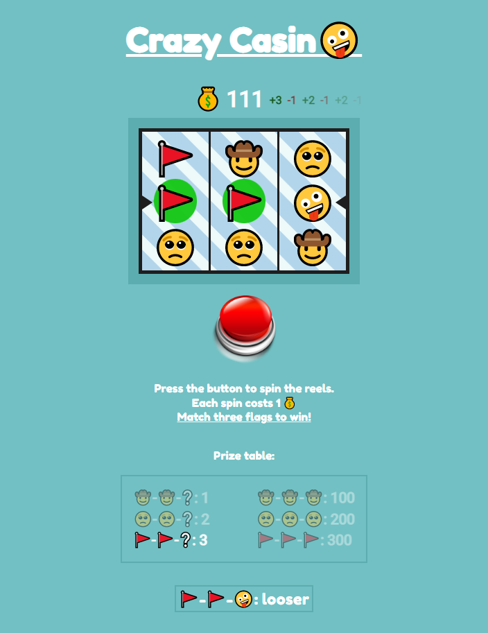
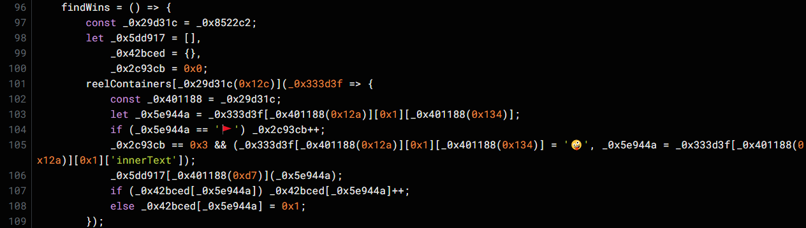
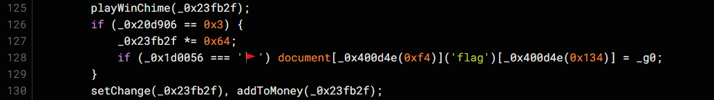
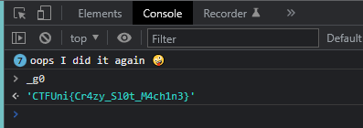

# Crazy Casino
- **Categoría:** Web
- **Dificultad:** ★★☆☆☆
- **Autor:** [ineesdv](https://www.linkedin.com/in/ineesdv/)

### Descripción
¡El casino está loco!  
Cada vez que parece que voy a ganar la máquina tragaperras hace trampas... 

### Archivos e instrucciones
Descargar `src.zip`

### Hints
1. ¿Dónde aparecen los emojis de 🤪 y 🚩?
2. ¿Has probado a cambiar emoticonos?
3. De4js podría ayudarte a ver el código más claro

### Flag
``CTFUni{Cr4zy_Sl0t_M4ch1n3}``   

 
  
## Créditos
**Créditos a [@mog13](https://codepen.io/mog13) por el código JavaScript original del casino**  

 

# Writeup
### 1. Primer vistazo
Es una simple página web que carga un fichero javascript.  

Cuando se va a ganar, la máquina tragaperras hace trampas y sustituye la tercera bandera por el emoticono 🤪:   
  

  

### 2. Desofuscar y entender el JS
Pasando el JavaScript por un desofuscador ([De4JS](https://lelinhtinh.github.io/de4js/) por ejemplo), podemos empezar a entender cómo funciona un poco el juego. 
Hay funciones y variables legibles (*startSpin, updateMoney, findWins*...)

Sabemos que se sustituye el emotiono de la bandera por "🤪". Buscando este emoticono aparece en múltiples ocasiones, algunas claramente para despistar, pero hay una que destaca:  
  
  

Viendo en detalle esa función (*findWins*), más abajo podemos ver que se hace un tipo de comprobación:  

`document[_0x400d4e(0xf4)]('flag')[_0x400d4e(0x134)] = _g0`

Parece que si se cumple una condición, se cambia un elemento del documento (de la página web) con nombre flag (casualmente el div de abajo del todo se llama flag...) y se inserta el contenido de "_g0".  

Buscando esta string, vemos que está muy ofuscada, sin embargo podemos loguearla directamente en la consola de JavaScript:
  

 

### Otras maneras de resolver el reto
- Simplemente con sustituir todos los emoticonos de 🤪 por 🚩, se puede resolver el reto.  
- También se podría quitar el check de la condición. 
- Cambiar el número de emoticonos de flags necesarios para mostrar la flag, de 1 a 2.
- ...

