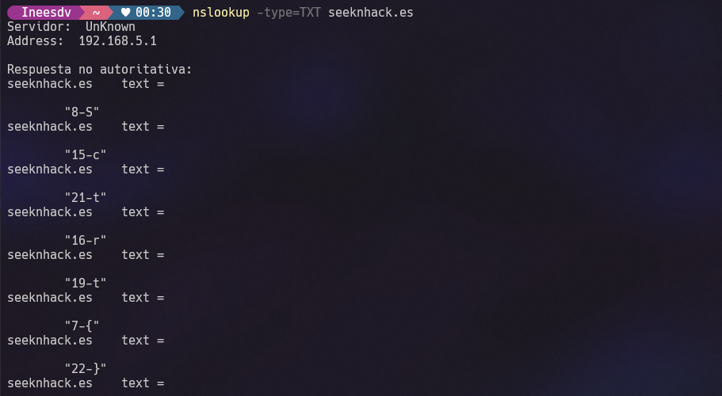

# Digging up the secret!
- **Categoría:** Misc
- **Dificultad:** ★★☆☆☆
- **Autor:** [ineesdv](https://www.linkedin.com/in/ineesdv/) & [diegodiaz1256](https://github.com/diegodiaz1256)

### Descripción
¡Me han dicho que SeekNHack esconde un secreto!  
Las instrucciones están en inglés y pone que tengo que excavar en los dominios de seeknhack, pero he hecho un boquete en la sala de la asociación de la uni y no encuentro nada…  
¿Puedes ayudarme a averiguarlo?

### Archivos e instrucciones
Ningún archivo necesario.

### Hints
1. Excavar es dig en inglés.
2. Dig es una herramienta que realiza búsquedas en los registros DNS. Prueba a ver si hay alguno interesante en seeknhack.es
3. Consulta los registros DNS de tipo TXT de seeknhack.es

### Flag
``CTFUni{SuperSecretttt}``

### Writeup
Buscando los "dominios de seeknhack", solamente hay uno: **seeknhack.es**  
  
En el enunciado se habla de "excavar", que se traduce al inglés como *dig*. Dig es una herramienta que realiza búsquedas en los registros DNS.  

Existen diferentes [tipos de entradas DNS](https://dinahosting.com/ayuda/tipos-de-registros-dns/), entre las cuales destacan las de tipo TXT.  
  
Al listarlas con `dig seeknhack.es txt` o `nslookup -type=TXT seeknhack.es` obtenemos varias entradas:    

    
  
Cada una de las entradas tiene el siguiente formato: `número-letra`.   
   

Si las ordenamos obtenemos la flag:   

  
   
 

Flag: **CTFUni{SuperSecretttt}**

