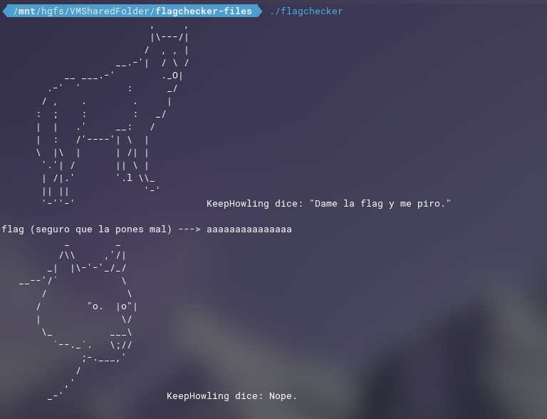
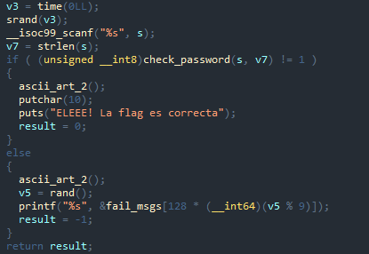
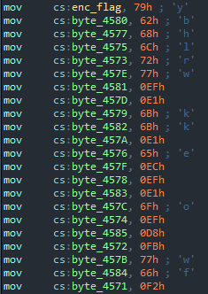
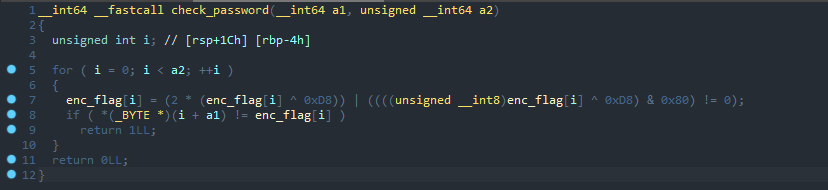
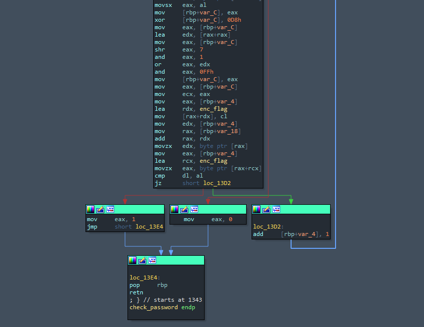
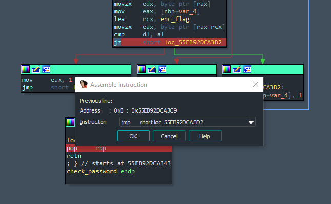
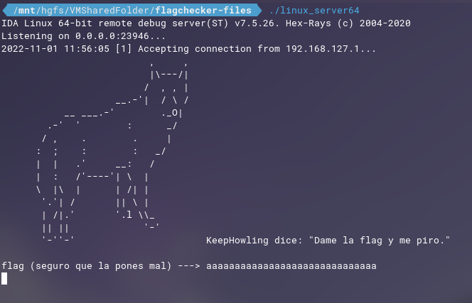
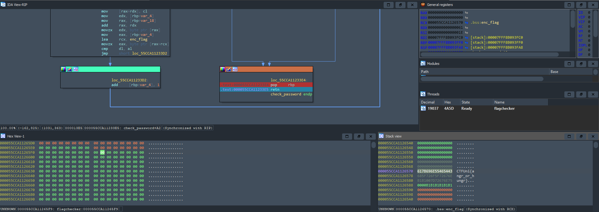

# Flagchecker
- **Categoría:** Reversing
- **Dificultad:** ★★★☆☆
- **Autor:** [KeepHowling](https://keephowling.es/)

### Descripción
Esto es un ctf y casi por obligación el equipo ha tenido que hacer un programa que compruebe si la flag que pones es correcta o no.  
Es un poco borde el programador, no dejéis que sus comentarios os afecten ;)  

### Archivos e instrucciones
flagchecker

### Hints
1. El programa contiene en memoria la flag ofuscada.
2. En algún momento se comprueban los caracteres de la flag.
3. Averigua en qué registro se realizan las comparaciones. Alternativamente puedes usar herramientas como angr.

### Flag
``CTFUni{angr_or_hungr}``

# Writeup
Con un vistazo rápido al binario vemos que nos pide una contraseña:  
  
  
Si probamos con `strings`, no encontraremos nada interesante. De la misma manera, lanzando `strace` o `ltrace`, vemos que tampoco podemos obtener la flag directamente.  

Abrimos el binario con un decompilador (en mi caso utilizaré IDA). Vemos que la función main llama a **check password**:  
   
  
    
A su vez, vemos que se carga una variable *enc_flag* en memoria:  
  

 
  
Viendo ahora la función de **check password** en detalle:  
  
  
  
Esta función transforma cada caracter de la variable *enc_flag* y los va comparando con el input introducido (esta comparación se hace en el registro `rcx`). Cuando uno de los caracteres falla, se para la ejecución del programa (`jz`).  
   

Para resolver el reto parchearé el `jz` por un `jmp`, de manera que independientemente de si la flag es correcta o no, no se pare la ejecución del programa. De esta manera se transformarán los caracteres de *enc_flag* y podremos obtener la flag cargada en memoria.  
   
   
 

Ahora, ejecutando el programa hasta el final de la función de *check_password* con cualquier input y mirando el contenido de `rcx` podremos encontrar la flag:  

   

  
    
  
    
**Flag:** CTFUni{angr_or_hungr}
