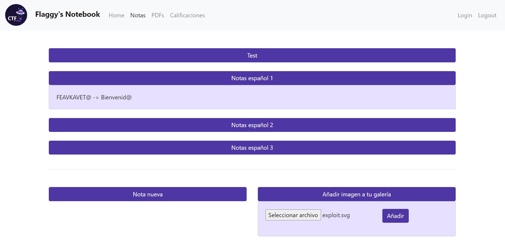
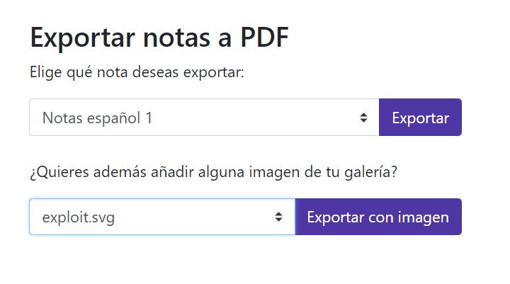
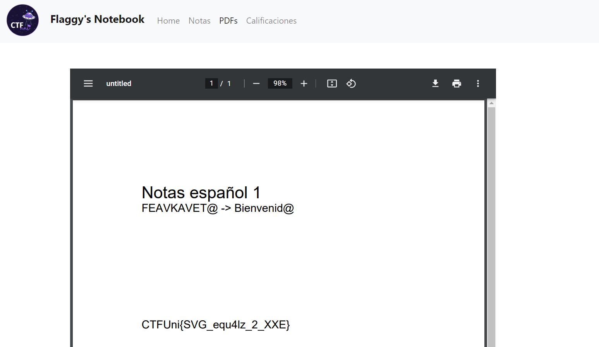

# Flaggy's Notebook
- **Categoría:** Web
- **Dificultad:** ★★★★☆
- **Autor:** [ineesdv](linkedin.com/in/ineesdv/)

### Descripción
¡Se acabaron las notas cutres! Flaggy ha implementado un cuaderno interactivo para que todos los universitarios puedan tomar notas rápidamente.

¡Hasta puedes añadirle imágenes en alta calidad a tus notas!  

Nota: el objetivo de este reto es explotar una vulnerabilidad web para leer el contenido de flag.txt
            
<br>

### Archivos e instrucciones
Conexión por HTTP al puerto ``5000``  
**Lanzar contenedor:** se incluyen los ficheros necesarios en /challenge. Ejecutando ./run.sh buildeará y deployeará el contenedor, exponiendo el puerto 5000.  

### Flag
``CTFUni{SVG_equ4lz_2_XXE}``  

<br>


# Writeup
### 1. Encontrar la vulnerabilidad
Se puede ver rápidamente que no hay ningún problema en el login, no hay SQLis, IDORs o SSTIs.  

Yendo a lo que más llama la atención en cuanto a funcionalidad es la subida de archivos y la parte de exportar a PDFs.  

Aunque se intente subir algún archivo malicioso, la subida de archivos solamente acepta **imágenes SVG** y guarda estas como string, por lo que no se logrará inyectar nada.  

Cuando exportas un PDF, se introducen dos elementos: una nota (con su título y contenido), y una imagen (SVG).  
Por descarte, tiene que encontrarse aquí la vulnerabilidad.  

Una rápida búsqueda en google sobre vulnerabilidades al subir SVGs hablará de ataques de XSS y de XXE.   
<br>

### 2. Explotación
Podemos descartar rápidamente el XXS, ya que vemos que no se inserta la imagen en el HTML (y que un XSS no nos permitirá leer flag.txt).   

También se podría haber encontrado la vulnerabilidad al analizar un PDF con BurpSuite y haber visto que se utiliza *reportlab*. Al buscar vulnerabilidades en reportlab, aparecen múltiples entradas de XXE en una librería que carga imágenes svg: **svglib**.  
  
Si investigamos sobre XXE se explica que un SVG puede incluir XML. Al incluir XML podemos cargar una entidad externa (como sería un fichero) e insertarla en la propia imagen. Al renderizar el PDF, se renderiza el SVG, y entonces se cargará flag.txt.


Cualquier payload de google sirve ("XXE SVG payload").

Ejemplo de exploit:

```xml
<?xml version="1.0" standalone="yes"?>
<!DOCTYPE test [ <!ENTITY xxe SYSTEM "file:///flag.txt" > ]>
<svg width="128px" height="128px"
	xmlns="http://www.w3.org/2000/svg"
	xmlns:xlink="http://www.w3.org/1999/xlink" version="1.1">
	<text font-size="16" x="0" y="16">&xxe;</text>
</svg> 
```
  
Ahora, al subir esta imagen SVG y exportar una nota cualquiera, obtendremos la flag:  

1. Subimos la imagen:  
  
    
2. Exportamos el PDF   
  
    
3. Obtenemos la flag:    
  
   

**Flag:** CTFUni{SVG_equ4lz_2_XXE}