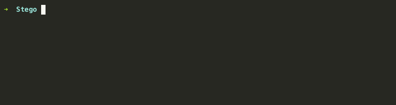
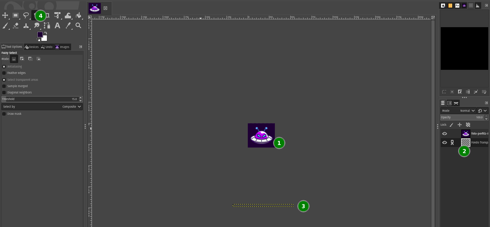

# Flaggy y las Redes Sociales
- **Categoría:** Stego
- **Dificultad:** ★★☆☆☆
- **Autor:** marcozucchi

### Descripción
Flaggy se ha hecho una nueva cuenta en la red social de moda SeekAGram y nos ha pasado su nueva foto de perfil por WhatsLab (este marcianito se lía mucho con tanta red social en el mundo terrestre). 
Nos ha pedido que le digamos nuestra opinión acerca de la foto, aunque parece que se ha corrompido al enviarla. ¿Podrías ayudarnos a recuperar la foto de perfil?

### Archivos e instrucciones

### Hints
    1. ¿De verdad se ha corrompido el archivo? ¿Estás seguro de que se trata de una imagen?
    2. Como dicen los ingleses, a veces es necesario “to think out of the box”.
    3. ¿Se puede cambiar el fondo a otro color más amigable?
  

### Formato de la flag
Formato de la flag: ``CTFUni{Texto_separado_por_barras_bajas}``  
Texto separado por barras bajas, primera letra mayúscula.

---

### WriteUp
En primer lugar, la foto proporcionada no se trata de una imagen PNG, sino que se trata de un archivo XCF de GIMP. Se procede a identificar el formato y a cambiar la extensión del archivo de PNG a XCF, para finalmente abrirlo con GIMP.

Una vez dentro de GIMP, ya podemos ver la foto y vemos que se trata de una foto normal y corriente (1) .
Sin embargo, a la derecha del editor de imágenes, podemos ver las diferentes capas que conforman el archivo (2) . Hay una capa que dice “Fondo Transparente” pero, ¿de verdad lo es? 
Si se da click, inicialmente no vemos que se resalte nada; pero resulta que la capa se encuentra muy por debajo del marco visible (si quitamos el zoom un poco se puede ver) (3).

Para exportar solo esa capa podemos arrastrarla desde el menú de la derecha (2) al cuadro de herramientas (4) . 
Como sigue sin verse del todo claro, se puede quitar el fondo o cambiar el color del fondo a blanco con la “varita mágica” o con la herramienta de relleno. 
Una vez hecho esto, hacemos click a `Archivo → Exportar como…` y guardamos la flag como imagen PNG (o cualquier otro tipo de archivo que soporte transparencia). 

### Flag
CTFUni{Nadie_mirara_por_aqui_90544b}

