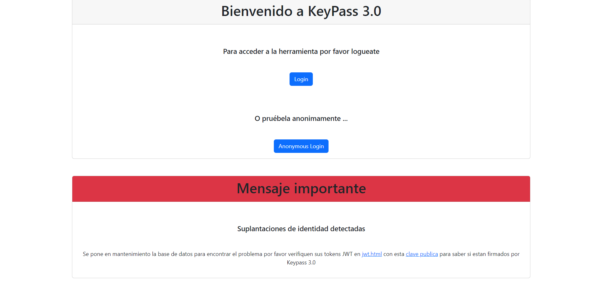
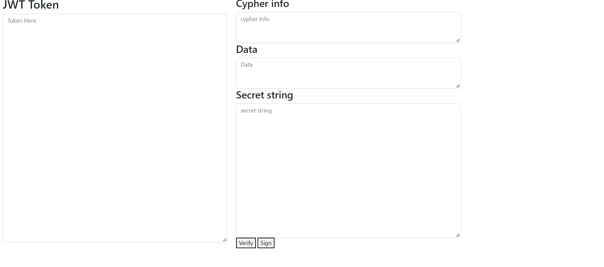
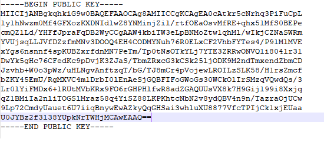
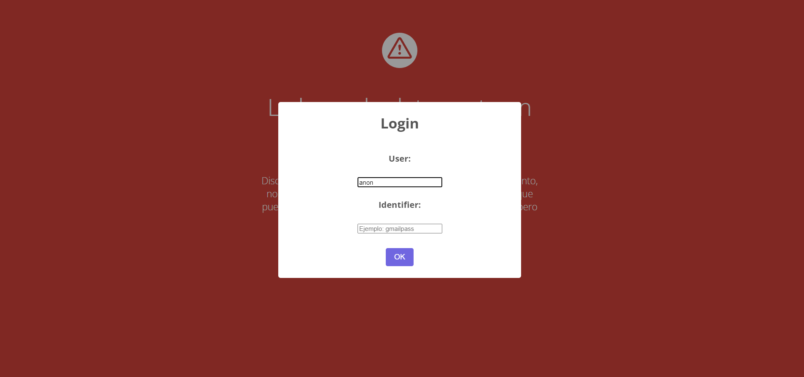
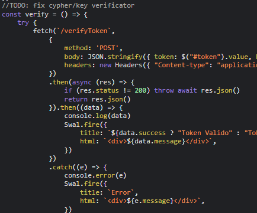
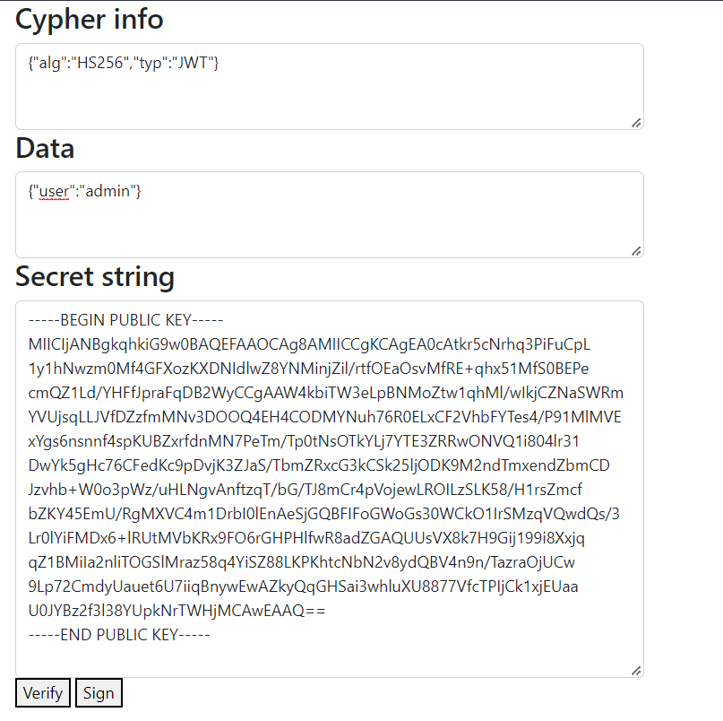
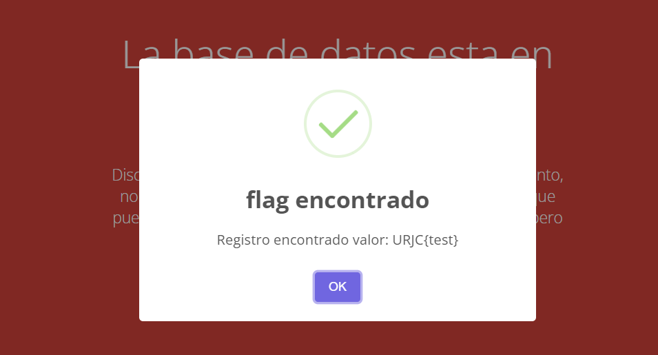

# KeyPass 3.0
- **Categoría:** Web
- **Dificultad:** ★★★☆☆
- **Autor:** [diegodiaz1256](https://github.com/diegodiaz1256)

### Descripción
Parece que algo ocurre en la caja fuerte digital más segura del mundo.
Puede que sea un simple mantenimiento, ¿pero y si es algo más?

### Archivos e instrucciones
1. Descargar `src.zip`
2. Descomprimir y correr `run.sh`

### Hints
1. Consigue acceder a los recursos del admin
2. El token JWT es vulnerable 
3. Puede que el servidor confunda los algoritmos

### Flag
``CTFUni{S0_u-Crack3d_1t?-T00_3a5y}``
 

# Writeup
### 1. Primer vistazo
Podemos jugar un poco con lo que nos ofrece la interfaz y encontraremos 3 cosas importantes:

- Pagina principal con botones de login anon-login  
    
   
- Un link a un verificador y firmador de jwt   
    
    
- Una clave publica  
    
   

Vamos probando cada una de ellas, encontrando que la fuerza bruta contra el login no funcionará y que con anon-login podemos llegar a una pagina MainMenu, pero que rápidamente nos redirecciona a una pagina de mantenimiento por supuestos problemas y se nos indica que solo se pueden consultar entradas pero no modificarlas ni escribir nuevas. Hay un formulario para pedir entradas.  

  

Intentamos lo más obvio, que sería solicitar la flag al formulario y nos indica que le pertenece a otro user y por lo tanto no podemos acceder a ella. 

  
### 2. Investigando el firmador y verificador de tokens

Entramos a jwt.html y observamos que importa un javascript jwt.js, en este hay un comentario:

  

Teniendo idea de como funciona rsa lo cual sabemos por el nombre de la key jwtRS256.key.pub, buscamos algo de información y de vulnerabilidades relacionadas con keys algoritmos (si tuviesemos dudas podriamos pedir la pista) y encontramos algo llamado "algorithm confussion" y probamos a firmar nuestro token con la clave publica no sin antes cambiar el campo user por admin y el campo alg por HS256, que seria un algoritmo simétrico, que podríamos usar por ejemplo. 

  

Firmamos nuestro token y nos lo asignamos a la cookie de jwt

Finalmente nos dirigimos a maintenance.html donde probaremos a pedir la entrada flag con nuestro nuevo token y ... 

  
 

## Autor

* Diego Fernandez Diaz
* [Twitter](https://twitter.com/diego_diaz_1256)
* [Linkedin](https://www.linkedin.com/in/fernandezdiazdiego/)
* [Web](https://zerogeworkshop.com/)
* [Github](https://github.com/diegodiaz1256/)