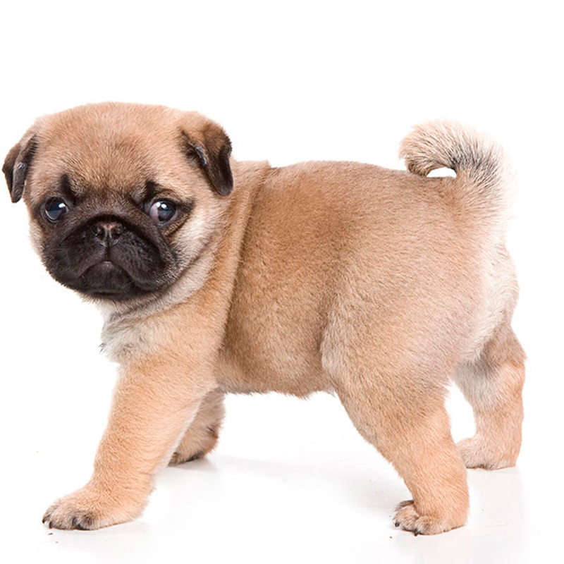
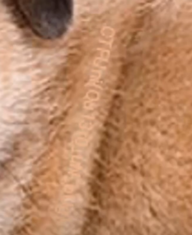
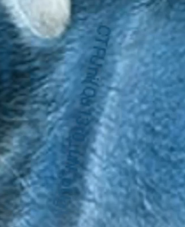

# Pug
- **Categoría:** Stego
- **Dificultad:** ★☆☆☆☆
- **Autor:** [isaaclo97](https://isaaclo97.github.io/)

### Descripción
Quiero un Pug  
   
    
### Hints
1. ¿Que collar le pondrias a tu pug?
2. No hace falta utilizar herramientas
3. Observa el cuello del pug
  

### Flag
`CTFUni{Qu13r0_uN_pUg}`  
  

 

# Writeup
Observamos un png de lo que parece ser un pug.

A primera vista podria parecer que no tiene nada raro pero si hacemos zoom en su cuello podremos observar como la flag se encuentra encima del cuello del perro.

Si invertimos la imagen podremos ver la flag mucho mejor.

 

**Vídeo con la resolución:**  

---
 

## Autor
* Isaac Lozano Osorio
* [Twitter](https://twitter.com/isaac_lozano_97)
* [Linkedin](https://www.linkedin.com/in/isaaclozanoosorio/)
* [Web](https://isaaclo97.github.io/)
* [Github](https://github.com/isaaclo97/)