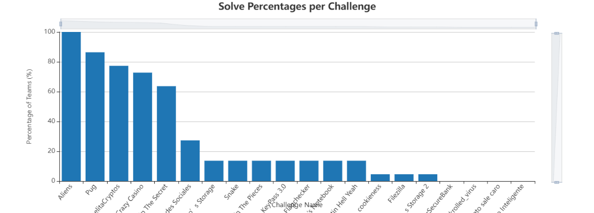
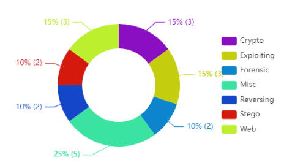
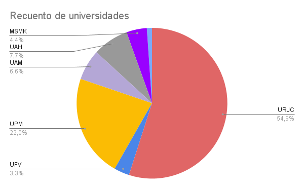
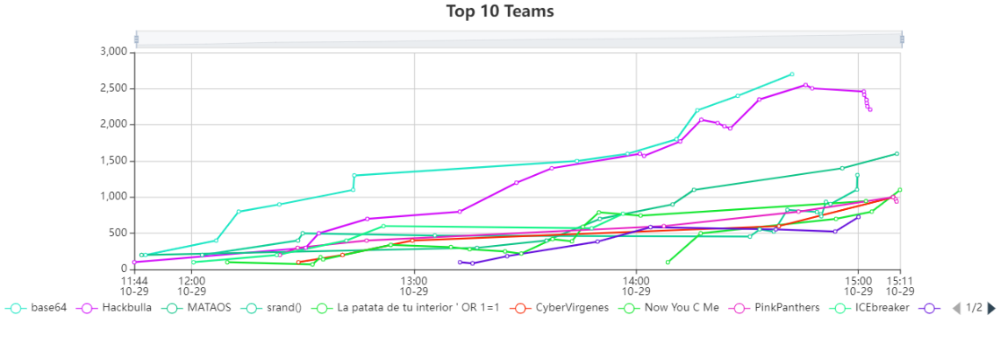

# CTFUni2022
Repositorio de retos de la primera edición de [CTFUni](https://seeknhack.es/ctfuniversitario/)
  - [Estadísticas](#estadisticas)
  - [Resultados](#resultados)
  - [Retos](#retos)

 

## Estadísticas
**Solves por reto**   
  
   

**Distribución de categorías**   
  
   

**Distribución de universidades**    
Contamos con más de 90 participantes pertenecientes a siete diferentes universidades de la Comunidad de Madrid:
  

   

## Resultados

**Scoreboard final**
<table class="table table-striped">

<thead>

<tr>

<td scope="col" width="10px"><b>Posición<b></td>

<td scope="col"><b>Equipo</b></td>

<td scope="col"><b>Puntos</b></td>

</tr>

</thead>

<tbody>

<tr>

<th scope="row" class="text-center">1</th>

<td>base64</td>

<td>2700</td>

</tr>

<tr>

<th scope="row" class="text-center">2</th>

<td>Hackbulla</td>

<td>2210</td>

</tr>

<tr>

<th scope="row" class="text-center">3</th>

<td>MATAOS</td>

<td>1600</td>

</tr>

<tr>

<th scope="row" class="text-center">4</th>

<td>srand()</td>

<td>1305</td>

</tr>

<tr>

<th scope="row" class="text-center">5</th>

<td>La patata de tu interior ' OR 1=1</td>

<td>1100</td>

</tr>

<tr>

<th scope="row" class="text-center">6</th>

<td>CyberVirgenes</td>

<td>1000</td>

</tr>

<tr>

<th scope="row" class="text-center">7</th>

<td>Now You C Me</td>

<td>945</td>

</tr>

<tr>

<th scope="row" class="text-center">8</th>

<td>PinkPanthers</td>

<td>940</td>

</tr>

<tr>

<th scope="row" class="text-center">9</th>

<td>ICEbreaker</td>

<td>770</td>

</tr>

<tr>

<th scope="row" class="text-center">10</th>

<td>Tux Not Not</td>

<td>725</td>

</tr>

<tr>

<th scope="row" class="text-center">11</th>

<td>3XPL01T</td>

<td>700</td>

</tr>

<tr>

<th scope="row" class="text-center">12</th>

<td>NoSeQueHagoAqui</td>

<td>625</td>

</tr>

<tr>

<th scope="row" class="text-center">13</th>

<td>El papel no COMPILA</td>

<td>600</td>

</tr>

<tr>

<th scope="row" class="text-center">14</th>

<td>KFCh</td>

<td>545</td>

</tr>

<tr>

<th scope="row" class="text-center">15</th>

<td>UnboxingTF</td>

<td>530</td>

</tr>

<tr>

<th scope="row" class="text-center">16</th>

<td>tortillacon.onion</td>

<td>525</td>

</tr>

<tr>

<th scope="row" class="text-center">17</th>

<td>hackermen</td>

<td>455</td>

</tr>

<tr>

<th scope="row" class="text-center">18</th>

<td>UAH has been pwned</td>

<td>315</td>

</tr>

<tr>

<th scope="row" class="text-center">19</th>

<td>ª</td>

<td>215</td>

</tr>

<tr>

<th scope="row" class="text-center">20</th>

<td>SPEED!</td>

<td>100</td>

</tr>

<tr>

<th scope="row" class="text-center">21</th>

<td>WinRAR</td>

<td>10</td>

</tr>

<tr>

<th scope="row" class="text-center">22</th>

<td>FuckError404</td>

<td>5</td>

</tr>

</tbody>

</table>

 

## Retos
### Forense 
- [Filezilla](Filezilla/) ★★★☆☆
- [Lo barato sale caro](LoBaratoSaleCaro/) ★★★★☆
  
### Web 
- [CrazyCasino 🤪](CrazyCasino/) ★★☆☆☆ 
- [KeyPass 3.0](KeyPass-3.0/) ★★★☆☆
- [Flaggy's Notebook](Flaggy'sNotebook/) ★★★★☆

### Crypto 
- [Aliens](Aliens/) ★☆☆☆☆ 
- [Join the pieces](JoinThePieces/) ★★☆☆☆ 
- [MartinHellYeah](MartinHellYeah/) ★★★★☆
 

### Stego
- [Pug](Pug/) ★☆☆☆☆ 
- [FlaggyRedesSociales](FlaggyRedesSociales/) ★★☆☆☆

### Reversing
- [Snake](Snake/) ★★☆☆☆ 
- [Flagchecker](Flagchecker/) ★★★☆☆ 
  
### Pwn 
- [Tito Klecko's Storage 1](TitoKlecko1/) ★☆☆☆☆ 
- [Cookieness](Cookieness) ★★★☆☆ 
- [Tito Klecko's Storage 2](TitoKlecko2/) ★★★★☆ 

### Misc
- [Digging up the secret](DiggingUpTheSecret/) ★★☆☆☆ 
- [María Dolores](AbuelitaCryptos/) ★★☆☆☆
- [SuperSecureBank](SuperSecureBank/) ★★★☆☆
- [CandadoInteligente](CandadoInteligente/) ★★★★★
- [Rickrolled](/rickrolled_virus.exe/) ★★★☆☆
