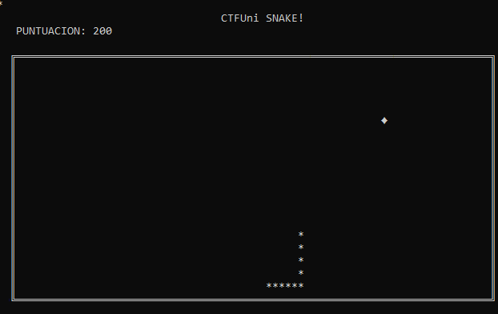
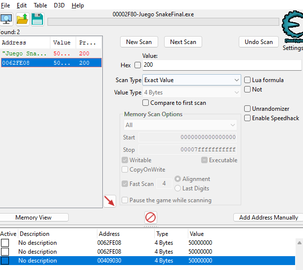
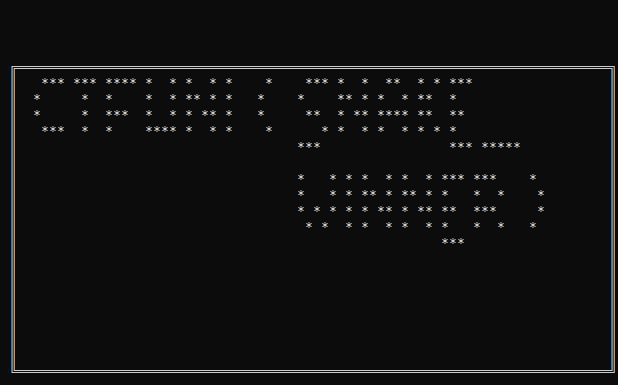
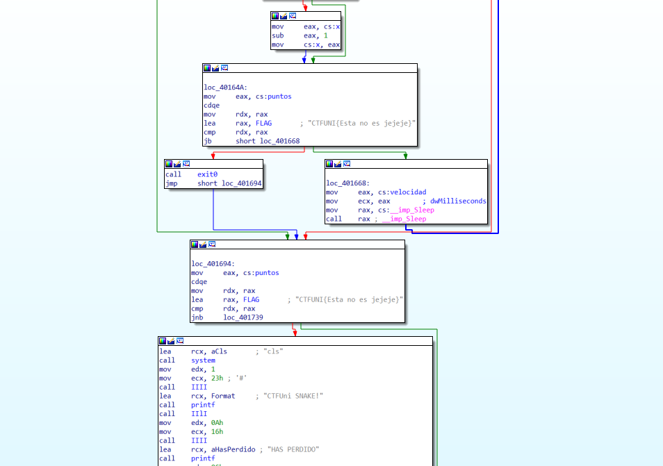
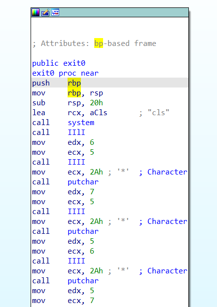
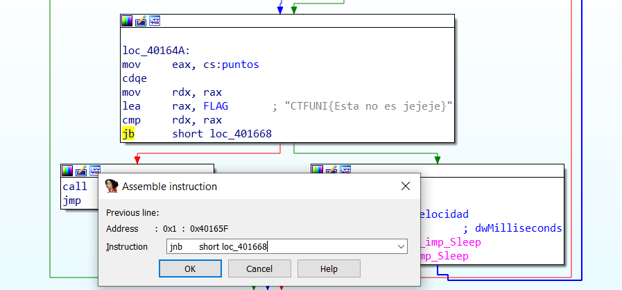

# Nombre del reto
- **Categoría:** Rev
- **Dificultad:** ★★☆☆☆
- **Autor:** [Sr4l0n50](https://www.linkedin.com/in/carlos-alonso-arranz-152ab7224/)

### Descripción
Todos hemos jugado al clasico juego del Snake, incluso los más mayores era su único juego en los móviles nokia.

Sin embargo, parece ser que este juego oculta algo. Afirman haber llegado a completar la serpiente y ver algo extraño.

¿Podras descubrirlo?
 

### Archivos e instrucciones
snake.exe

### Hints
1. ¿Cúal será el máximo de puntos para ganar?
2. Las condiciones pueden cambiarse.
3. CheatEngine

### Flag
``CTFUni{SNAKE_WINNER}``  

# Writeup
### 1. Analizar el ejecutable
Lo primero será analizar el código en busca de strings, pero no sale nada reseñable. El código parece ligeramente ofuscado unos cuantos if que se podrían
intentar esquivar o modificar.

Analizando el código podemos observar como existe una tecla para pausar el juego. Esto nos ayudará más adelante.

      
En cuanto al juego, es el tipico juego de snake donde se suman punto hasta perder. Tras esto aparecerá la puntuación obtenida y vuleta a empezar.
      
### 2. CheatEngine
Para resolver el reto se ha propuesto el uso de CheatEngine. Vamos a tratar de modificar los valores de puntuación ya que es un valor que podemos ver 
como varía por pantalla y encontrar facilmente su dirección de memoria. Además es facil que la solución este relacionada.
      
Como hemos dicho, podemos pausar el juego para ayudarnos a usarlo con CheatEngine. Solamente nos tenemos que comer unas bolitas, buscar ese valor
y comprobar que el que aparece es el correcto.
      

 

  

### 3. Obtención de la flag
Una vez modificados los valores, nos saldrá por pantalla la flag impresa!

 

---

### Otra manera de resolver el reto
Decompilando el exe, podemos ver el grafo de ejecución:  

  
Vemos que se comprueba la puntuación, si tenemos los puntos necesarios se nos imprimirá la flag (¡¡en la función exit0!!), y si no los tenemos, continuaremos jugando hasta que perdamos.  

Entrando a ver la función *exit 0* en profundidad, vemos que imprime caracteres:  
  
Será complicado reconstruirlo para ver la flag.  

Sin embargo, podemos cambiar la condición que comprueba los puntos. Si cambiamos el jb por un jnb, haremos que, cuando NO tengamos los puntos suficientes se imprima la flag:  

Guardamos los cambios (¡importante!) y al ejecutar el programa, obtendremos la flag directamente:  
