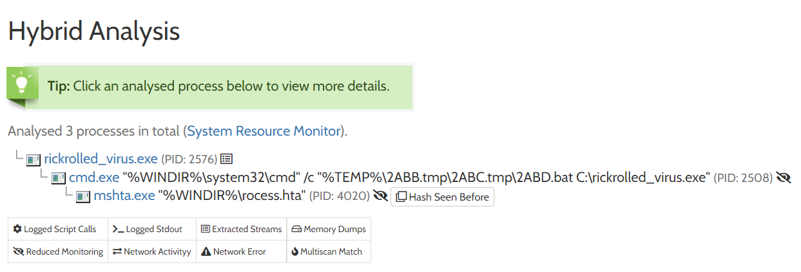
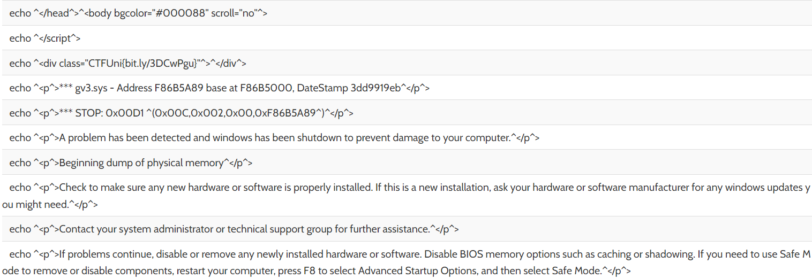

# Rickrolled_virus
- **Categoría:** Misc
- **Dificultad:** ★★★☆☆
- **Autor:** [KeepHowling](https://keephowling.es/)

### Descripción
Nos han entregado un .exe que bloquea el ordenador y no sabemos qué hacer con el... Aparecen errores de drivers y dlls pero el departamento de IT está demasiado ocupado bailando al son del "Never gonna give you up" del maravilloso Rick Astley. Ayúdales a escapar del pantallazo azul y encuentra la flag.  

### Archivos e instrucciones
rickrolled_virus.exe

### Hints
1. El virus es muy troll. La flag se encuentra en una URL que encontarás en algun momento.
2. ¿Qué hace realmente el virus? ¿Cómo funciona?
3. Monitorizando las acciones del virus podrás obtener más información.

### Flag
``CTFUni{espero_que_te_sepas_la_letra_ya}``

 

# Writeup
## Paso 1: análisis inicial
Es un .exe, un ejecutable de windows.  
Tools: PEstudio, DetectItEasy, Exeinfo PE, PE-bear

Es un PortableExecutable de 64 bits (PE en adelante). 
Esta "packed" con UPX --> hace muy difícil desensamblar el PE

## Paso 2: unpacking UPX
Tools: XVolkolak, UPX (https://upx.github.io/) 

Comprobamos que ya no esta con la protección del UPX con DIE  

## Paso 3: ejecución del PE
 como es un PE podemos ejecutarlo desde la Powershell o dando doble click.
 ``G:\CTFUni> .\rickrolled_virus.exe`` 

El Blue Screen Of Death (BSOD) aparece y no nos permite salir, hacemos click izquierdo salta un error de dlls 

Si hacemos ``Alt + tabulador``  o ``Win`` podemos escapar de esa ventana simplemente con click derecho y cerrar ventana.

Si sigue apareciendo la pantalla azul, la volvemos a cerrar hasta que nos deje en paz. 
Ya sabemos qué hace el PE, muestra una simulación del BSOD.
Es un hta que con processHacker podemos inspeccionar

## Paso 4: a buscar la flag.
Vamos a inspeccionar el hta que se crea, con el process monitor podemos verlo directamente, hacemos doble click y tenemos esto:

Vamos a ir mirando las propiedades a ver qué saca

muchas flags, MUCHAS

No sólo es el BSOD sino que también ha creado 100 flags. ¿Estará la nuestra?

No tiene pinta de que sean la flag. Vamos a inspeccionar el proceso más de cerca.  
  
en la ventana de Memory vemos que podemos extraer strings.
Filtramos con CTF y...  

BINGO

Nos lleva a un pastebin llamado  

Si bajamos un poco... tenemos nuestra flag
``CTFUni{espero_que_te_sepas_la_letra_ya}``

 

---

### Otra manera de resolver el reto
Subir el virus a una sandbox, por ejemplo [Hybrid](https://www.hybrid-analysis.com/).  

Viendo el reporte, vemos que el virus crea un hta malicioso:
  
  

Analizando el hta, podemos ver que en realidad el virus está ejecutando echos para crear la interfaz. Entre ellos encontramos rápidamente un link:   
  

Este link ya no es una rickrolleada, si no que nos lleva al [pastebin](https://bit.ly/3DCwPgu) que contiene la flag. 

**Flag:** ``CTFUni{espero_que_te_sepas_la_letra_ya}``

